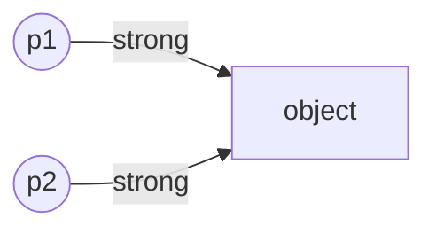
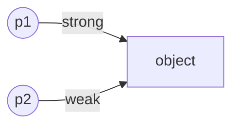
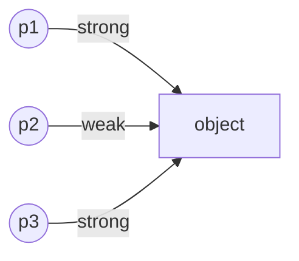

# Descriptor

## Why we need descriptor?

Suppose we want the class Point2d that take always two integer value.

```python
class Point2D:
    @property
    def x(self):
        return self._x

    @x.setter
    def x(self, value):
        self._x = int(value)

    @property
    def y(self):
        return self._y

    @y.setter
    def y(self, value):
        self._y = int(value)
```

1. there are repetitive code. so overcome this problem we will create the separate class with get and set method.
2. tell python bind this class instance.

```python
class IntegerValue:
    def get(self):
        return self._value

    def set(self, value):
        self._value = int(value)

    def __init__(self, value=None):
        if value:
            self.set(value)


class Point2D:
    x = IntegerValue()
    y = IntegerValue()
```

1. `IntegerValue()` is bound the class not to instance of point2d.
2. Inorder to make this class to bound with the instance of the point2d. we need ot implement the descriptor protocol.

## Descriptor protocol

| method         | Usage                      |
|----------------|----------------------------|
| `__get__`      | to get the attribute value |
| `__set__`      | to set value               |
| `__delete__`   | to delete attribute        |
| `__set_name__` |                            |

## Type of Descriptor

1. `Non data descriptor` -> those that implement `__get__` only
2. `data descriptor` -> those that implement `__set__` and /or `__delete__`

# Getter and Setter

## `__get__` method

| argument    | usage                                                                                                                                                                                                                               |
|-------------|-------------------------------------------------------------------------------------------------------------------------------------------------------------------------------------------------------------------------------------|
| self        | *instance of descriptor*                                                                                                                                                                                                            |     
| instance    | **From where this descriptor instance is called**<br/>1. instance is None -> called from the class where the descriptor is used<br/>2. instance is not none , then it is called from instance of class where the descriptor is used |
| owner_class | Where the descriptors is created                                                                                                                                                                                                    |

So we can return different value from `__get__` method depends upon where the descriptor is called.

1. called from class ->  we return the instance of the descriptor like property we have
2. called from instance -> we return the attribute value

```pycon
>>> import datetime
>>> class TimeUTC:
...     def __get__(self, instance, owner):
...         if instance is None:
...             return self
...         return datetime.datetime.now().isoformat()
...
>>> class Logger:
...     current_time = TimeUTC()
...
>>> Logger.current_time
<__main__.TimeUTC object at 0x000001F5D784E6D0>
>>> l = Logger()
>>> l.current_time
'2022-11-25T12:43:21.989635'
```

this consistence with `property class`.gives us an easy handle to descriptor instance.

```pycon
>>> class Logger:
...     @property
...     def current_time(self):
...         return datetime.datetime.now().isoformat()
...
...
>>> Logger.current_time
<property object at 0x000001F5D780F510>
>>> l = Logger()
>>> l.current_time
'2022-11-25T12:48:20.013743'
```
## `__set__` method

| argument | usage                                        |
|----------|----------------------------------------------|
| self     | same as the `__get__`                        |
| instance | same as the `__get__`                        |
| value    | the value we want to assign to the attribute |

1. there is no `owner_class` in the descriptor
2. setter *always called from the instance*

## Caveat 
```python
class Logger:
    current_time = TimeUTC()
```
1. only **single instance of descriptor is created* for **all the instance of Logger class.**
2. all the instance of Logger class sharing the same instance of descriptor

```pycon
>>> class IntegerValue:
...     def __set__(self, instance, value):
...         self._value = int(value)
...     def __get__(self, instance, owner_class):
...         if instance is None:
...             return self
...         else:
...             return self._value
...
>>> class Point2D:
...     x = IntegerValue()
...     y = IntegerValue()
...
>>> p1 = Point2D()
>>> p2 = Point2D()
>>> p1.x = 1.1
>>> p1.y = 2.2
>>> print(p1.x, p1.y)
1 2
>>> p2.x = 100.9
>>> p2.y = 200.9
>>> print(p1.x, p1.y)
100 200
>>> print(p2.x, p2.y)
100 200
```
both p1 and p2 are pointing to same instance of descriptor.

# Storing the attribute
## Where to store the attribute value?
1. We could store the attribute in the instance
2. We could store the attribute in the descriptor instance itself

### Instance Dictionary

```pycon
>>> class IntegerValue:
...     def __set__(self, instance, value):
...         instance.stored_value = int(value)
...     def __get__(self, instance, owner_class):
...         if instance is None:
...             return self
...         else:
...             return getattr(instance, 'stored_value', None)
...
>>> class Point1D:
...     x = IntegerValue()
...
>>>
>>> p1, p2 = Point1D(), Point1D()
>>> p1.x = 10.1
>>> p2.x = 20.2
>>> print(p1.x, p2.x)
10 20
>>> print(p1.__dict__, p2.__dict__)
{'stored_value': 10} {'stored_value': 20}
```

1. As you can see, we now have a descriptor that uses the instances themselves to store the data.
2. But you'll notice that our descriptor is hard coded to using the same key in the instance dictionaries - which leads
   us to this problem

```pycon
>>> class Point2D:
...     x = IntegerValue()
...     y = IntegerValue()
...
>>> p = Point2D()
>>> p.x = 10.1
>>> p.__dict__
{'stored_value': 10}
```

And what happens if we set y? What symbol is the descriptor going to use to store the value in the instance?

```pycon
>>> p.y = 20.2
>>> p.__dict__
{'stored_value': 20}
>>> p.x, p.y
(20, 20)
```
1. Since we hardcode the attribute name . this approach doest work
2. So that approach is not going to work either. Somehow we would need to have a distinct storage name for each property.
3.  Why cannot we pass the attribute name also.

```pycon
>>> class IntegerValue:
...     def __init__(self, name):
...         self.storage_name = '_' + name
...
...     def __set__(self, instance, value):
...         setattr(instance, self.storage_name, int(value))
...
...     def __get__(self, instance, owner_class):
...         if instance is None:
...             return self
...         else:
...             return getattr(instance, self._storage_name, None)
...
>>> class Point2D:
...     x = IntegerValue('x')
...     y = IntegerValue('y')
...
>>> p1 = Point2D()
>>> p2 = Point2D()
>>> p1.x = 10.1
>>> p1.y = 20.2
>>> p1.__dict__
{'_x': 10, '_y': 20}
>>> p2.x = 100.1
>>> p2.y = 200.2
>>> p2.__dict__
{'_x': 100, '_y': 200}
```
So this approach can work just fine, but there are a few drawbacks:

1. The user needs to specify the name of the property twice
2. We assume that `_ + name` is not also used by the class in which the descriptor exists (so that could be a major
   problem)
3. We assume we can add an attribute to the instance - but what if it uses slots?

One way we could get around each of those problems is by using the descriptor instance itself to store the instance
values. But as we saw earlier, we can't just set an attribute in the descriptor instance, since that would be shared
across multiple instances of the class containing the descriptor.

### Descriptor Dictionary

```pycon
>>> class IntegerValue:
...     def __init__(self):
...         self.values = {}
...
...     def __set__(self, instance, value):
...         self.values[instance] = int(value)
...
...     def __get__(self, instance, owner_class):
...         if instance is None:
...             return self
...         else:
...             return self.values.get(instance)
...
>>> class Point2D:
...     x = IntegerValue()
...     y = IntegerValue()
...
>>> p1 = Point2D()
>>> p2 = Point2D()
>>>
>>> p1.x = 10.1
>>> p1.y = 20.2
>>> p1.x, p1.y
(10, 20)
```

Even we could see the dictionary of descriptor instance

```pycon
>>> Point2D.x.values
{<__main__.Point2D object at 0x000001F5D786F850>: 10} 
>>> Point2D.x.values
{<__main__.Point2D object at 0x000001F5D786F850>: 10} 
>>> hex(id(p1))
'0x1f5d786f850'
```

we can do same for the second point.

```pycon
>>> p2 = Point2D()
>>> p2.x = 100.1
>>> p2.y = 200.2
>>> hex(id(p2))
'0x1f5d786f890'
>>> Point2D.x.values
{<__main__.Point2D object at 0x000001F5D786F850>: 10, <__main__.Point2D object at 0x000001F5D786F890>: 100} 
>>> Point2D.y.values
{<__main__.Point2D object at 0x000001F5D786F850>: 20, <__main__.Point2D object at 0x000001F5D786F890>: 200} 
>>> p1.x, p1.y, p2.x, p2.y
(10, 20, 100, 200)
```

We actually have a potential memory leak - notice how the dictionary in the descriptor instance is also storing a
reference to the point object - as a key in the dictionary.

```pycon
>>> def ref_count(address):
...     return ctypes.c_long.from_address(address).value
...
>>> p1 = Point2D()
>>> id_p1 = id(p1)
>>> ref_count(id_p1)
1
>>> p1.x = 100.1
>>> ref_count(id_p1)
2
>>> 'p1' in globals()
True
>>> del p1
True
>>> ref_count(id_p1)
1
>>> Point2D.x.values.items()
dict_items([(<__main__.Point2D object at 0x0000023A73A6E710>, 100)])
>>> hex(id_p1)
'0x23a73a6e710'
```

As you can see, the last element's key is the same id as what p1 was referencing.

So, although we deleted p1, the object was not destroyed - this can result in a memory leak.
There are a few ways we can handle this issue. The first one we are going to look at is something called weak
references.

# Strong and weak reference

## Strong Reference

```python
p1 = Person()
p2 = p1
```



1. `del p1` there is still a strong reference (p2) to the object. object is still "alive", so Python does not garbage
   collect it.
2. `del p2` there is no to the object. object will be garbage collected by Python.

**That's the problem we faced in our data descriptor**

## Weak reference

1. think of it as a reference to an object that does not affect the reference count as far as the memory manager is
   concerned



1. `del p1` there no strong reference to the object. so Python does not garbage  collect it.
2. `p2` is dead.

```python
import weakref

p1 = Person()
p2 = weakref.ref(p1)
```
1. p2 is callable.
2. when p2 is called it return the original object. or None if object is garbage collected.

```python
p3 = p2()
```

p3 hold the strong reference of person object.BE CAREFUL when calling the weakref

# Storing in descriptor Instance
Refer the notebook

# `__set_name__` method
1. this method is called once the `descriptor first instantiated`
2. This make life much easier
   1. we can have better error message
   2. if class does not have the slot then we can store the date in the class instance no need to store in the
      descriptor instance , under the *same name*
   3. **If we store under same name in the instance dictionary does it shadow the class attribute**
      1. **Not always** there is different between the **Non data descriptor Vs data descriptor**

```pycon
>>> class ValidString:
...     def __set_name__(self, owner, name):
...         print(f"__set_name__ called from owner={owner} with property_name = {name}")
... 
>>> class Person:
...     name = ValidString()
... 
__set_name__ called from owner=<class '__main__.Person'> with property_name = name
```
`__set__name__` get called once the descriptor instance created and pass the *property name as argument*

## Better Error Message
```pycon
>>> class ValidString:
...     def __init__(self, min_length=None):
...         self.min_length = min_length

...     def __set_name__(self, owner, name):
...         self.property_name = name

...     def __set__(self, instance, value):
...         if not  isinstance(value,str):
...             raise ValueError(f"{self.property_name} must be string")
...         elif self.min_length is not None and len(value) < self.min_length:
...             raise ValueError(f"{self.property_name} must have at least {self.min_length} characters.")
...         key = "_" + self.property_name
...         setattr(instance,key,value)

...     def __get__(self, instance, owner):
...         if instance is None:
...             return self
...         else:
...             key = "_" + self.property_name
...             return getattr(instance,key,None)
...
>>> class Person:
...     first_name = ValidString(1)
...     last_name = ValidString(2)
...
>>> p = Person()
```
```pycon
>>> try:
...     p.first_name = "some"
...     p.last_name = "A"
... except ValueError as ex:
...     print(ex)
...
last_name must have at least 2 characters.

>>> try:
...     p.first_name = ""
...     p.last_name = "A"
... except ValueError as ex:
...     print(ex)
...
first_name must have at least 1 characters.
```

## same name as class attribute
refer the notebook

# Descriptor Loop up Resolution

## Bare Attribute

1. python search in the `instance __dict__` , if _found_ return the value from the `instance __dict__`.
2. **not found** in the `instance __dict__` , then looks in the `class __dict__`

## Data Descriptor
when the `__get__` and `__set__` defined.
1. **Always override the instance dictionary**
```pycon
>>> class DataDescriptor:
...     def __set__(self, instance, value):
...         print(f"__set__ called")

...     def __get__(self, instance, owner):
...         print("__get__ called")
... 
>>> class Test:
...     x = DataDescriptor()
... 

>>> t = Test()

>>> t = Test()
>>> t.x
__get__ called
>>> t.x = "100"
__set__ called
>>> t.__dict__
{}
```
1. since instance does not the same name it directly go to class instance then to the descriptor.
2. Let the same name to instance dict . and see how python behave

```pycon
>>> t.__dict__["x"] = "hello"

>>> t.x
__get__ called
>>> t.x = 200
__set__ called
>>>
```

1. Even though instance dictionary has the same name. it goes to class and then to descriptor . No going through the
   instance dictionary
2. This happens only for the data descriptor.


## Non data descriptor
when only `__get__` is defined.
1. look in the `instance dictionary first`
2. if not present the then look in the `class dict`
Same as the bare attribute

```pycon
>>> class NonDataDescriptor:
...     def __get__(self, instance, owner):
...         print("__get__ called")
...
>>> class Test:
...     x = NonDataDescriptor()
...
>>> t = Test()
>>> t.x       
__get__ called
>>> t.__dict__
{}
```

1. since instance does not the same name it directly go to class instance then to the descriptor.
2. Let the same name to instance dict . and see how python behave

```pycon
>>> t.__dict__["x"] = "hello"
>>> t.x
'hello'
```
1. python find the instance dictionary and return to value.

this distinct between the data descriptor and non data descriptor, made us use the same name in instance dictionary as
in the class dictionary .


